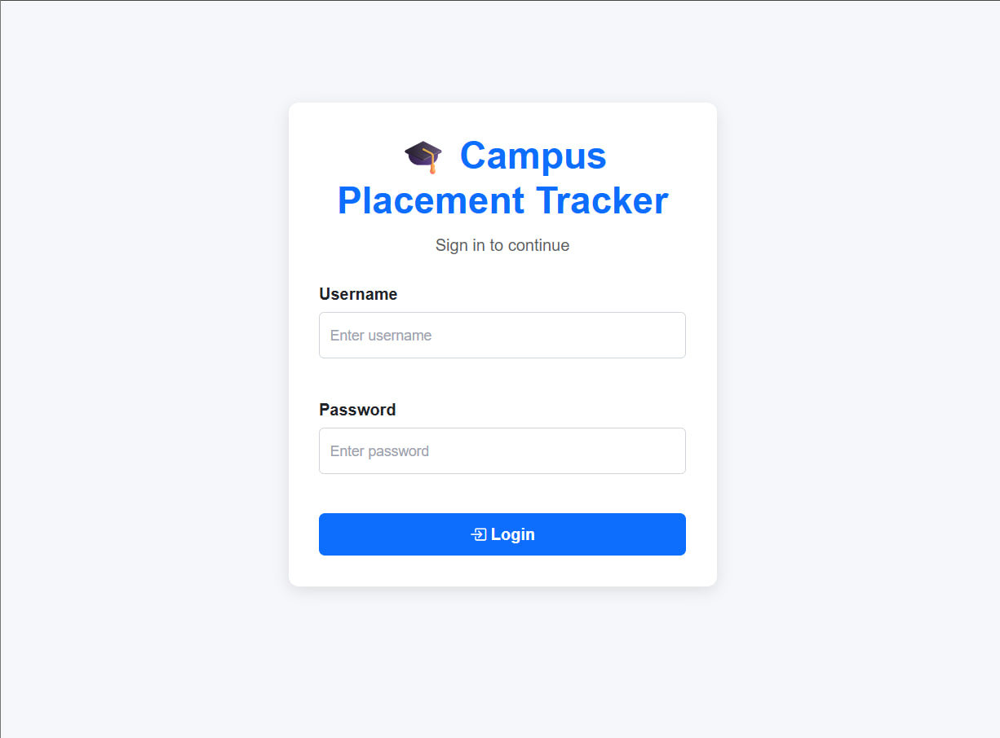
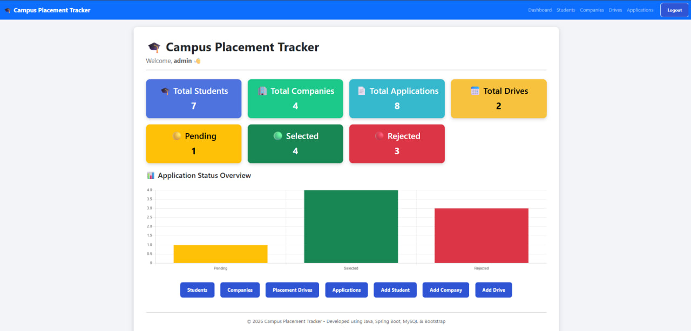
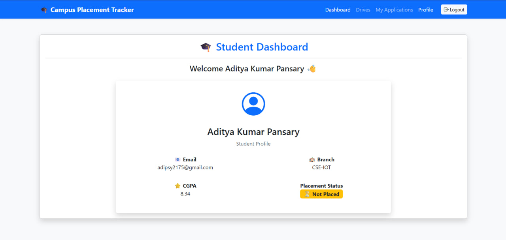
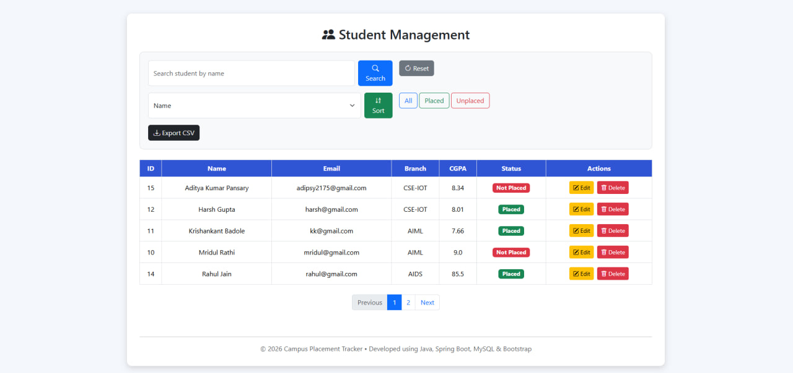
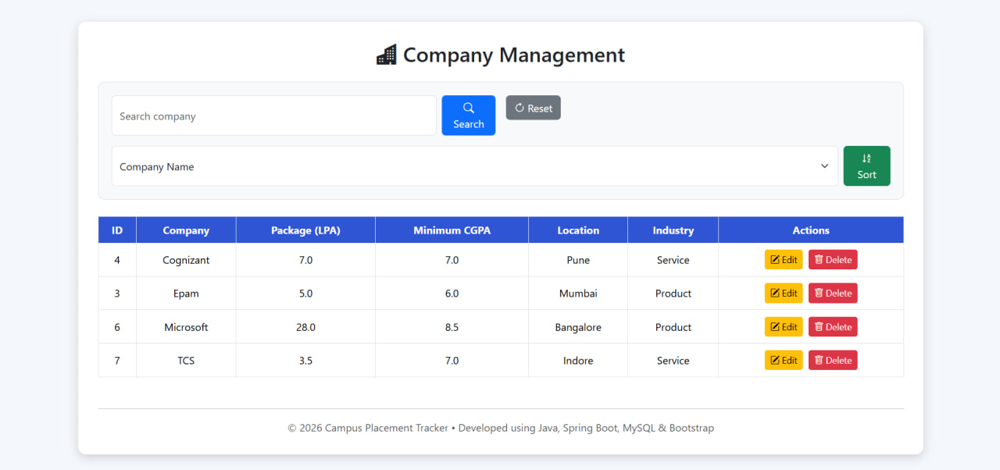
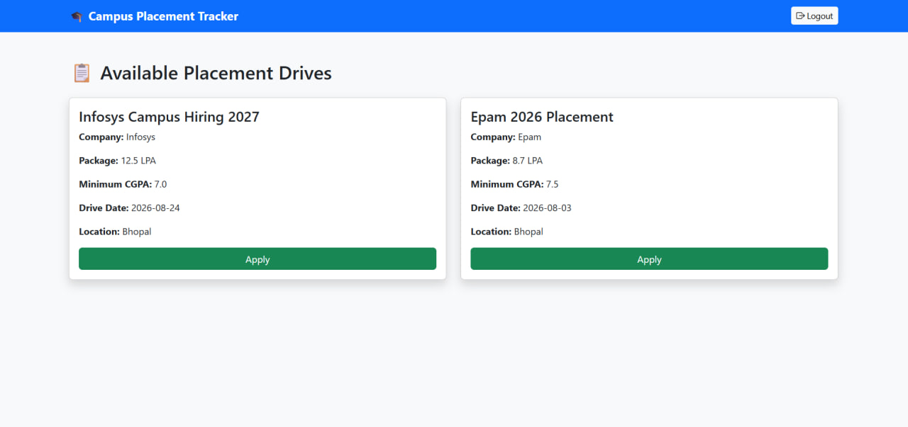
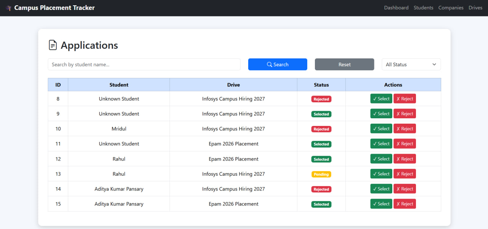
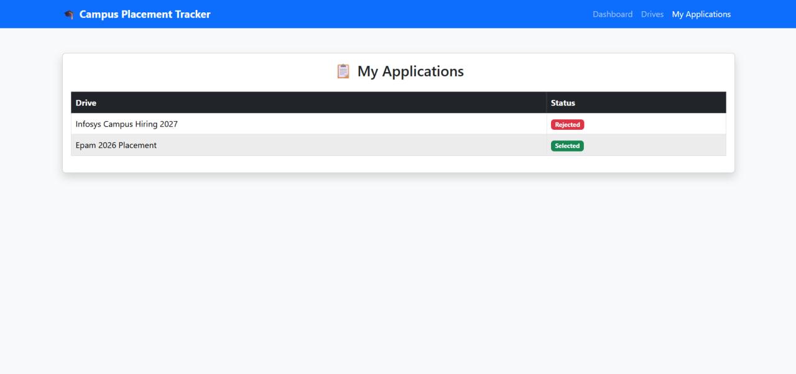

# 🎓 Campus Placement Tracker

A full-stack Campus Placement Management System built using **Java**, **Spring Boot**, **Spring Security**, **Spring Data JPA**, **Hibernate**, **MySQL**, **Thymeleaf**, **Bootstrap**, and **Chart.js**.

The application provides a secure role-based portal where administrators manage placement activities while students can view placement drives, apply for eligible drives, and track their application status.

---

# ✨ Features

## 👨‍💼 Admin Module

- Secure Admin Login
- Dashboard with Placement Analytics
- Manage Students
- Manage Companies
- Manage Placement Drives
- View Applications
- Select / Reject Applications
- Student Search
- Company Search
- Drive Search
- Sorting
- Pagination
- CSV Export
- Dashboard Charts

---

## 👨‍🎓 Student Module

- Secure Student Login
- Personal Dashboard
- View Profile
- View Placement Drives
- Apply for Placement Drives
- Eligibility Check (CGPA)
- Duplicate Application Prevention
- Track Application Status

---

# 🔐 Authentication & Security

- Spring Security
- Role-Based Authentication
- BCrypt Password Encryption
- Admin Authorization
- Student Authorization
- Session Management

---

# 🛠 Tech Stack

### Backend

- Java 17
- Spring Boot
- Spring MVC
- Spring Security
- Spring Data JPA
- Hibernate

### Frontend

- Thymeleaf
- HTML5
- CSS3
- Bootstrap 5
- Bootstrap Icons
- Chart.js

### Database

- MySQL

### Build Tool

- Maven

### IDE

- IntelliJ IDEA

### Version Control

- Git
- GitHub

---

# 📂 Project Structure

```
src
├── controller
├── service
├── repository
├── entity
├── dto
├── config
├── enums
├── templates
├── static
└── resources
```

---

# 🏗 Project Architecture

```
Browser
     │
     ▼
Spring MVC Controller
     │
     ▼
Service Layer
     │
     ▼
Repository Layer
     │
     ▼
MySQL Database
```

---

# 📊 Functional Workflow

```
Student Login
      │
      ▼
View Placement Drives
      │
      ▼
Apply for Drive
      │
      ▼
Eligibility Verification
      │
      ▼
Application Submitted
      │
      ▼
Admin Reviews Application
      │
      ▼
Selected / Rejected
      │
      ▼
Student Views Updated Status
```

---

# 📸 Screenshots

## Login Page



---

## Admin Dashboard



---

## Student Dashboard



---

## Students



---

## Companies



---

## Placement Drives



---

## Applications



---

## My Applications



---

# 🚀 Installation

### Clone Repository

```bash
git clone https://github.com/YOUR_USERNAME/Campus-Placement-Tracker.git
```

---

### Open Project

Open using IntelliJ IDEA.

---

### Configure Database

Create a MySQL database.

```sql
CREATE DATABASE campus_placement_tracker;
```

Update the following in `application.properties`:

```properties
spring.datasource.url=jdbc:mysql://localhost:3306/campus_placement_tracker
spring.datasource.username=YOUR_USERNAME
spring.datasource.password=YOUR_PASSWORD
```

---

### Run

```bash
mvn spring-boot:run
```

---

# 📈 Future Enhancements

- Resume Upload
- Email Notifications
- Password Reset
- Interview Scheduling
- Profile Picture
- Placement Reports
- Company Logo Upload
- Notification Center

---

# 👨‍💻 Author

**Aditya Kumar Pansary**

B.Tech CSE (Internet of Things)

Backend Java Developer

GitHub:
https://github.com/AdiPsy2175

LinkedIn:
https://www.linkedin.com/in/aditya-pansary/

---

# ⭐ If you like this project, don't forget to star the repository.
